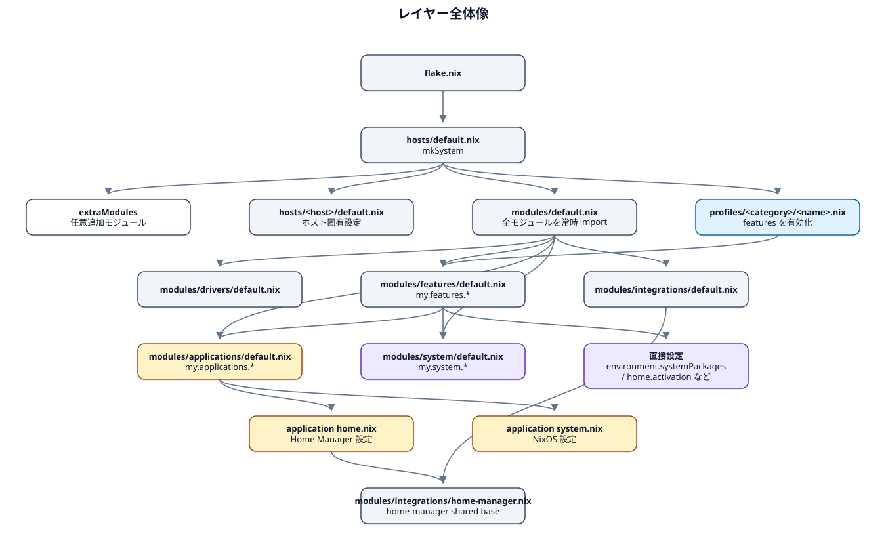
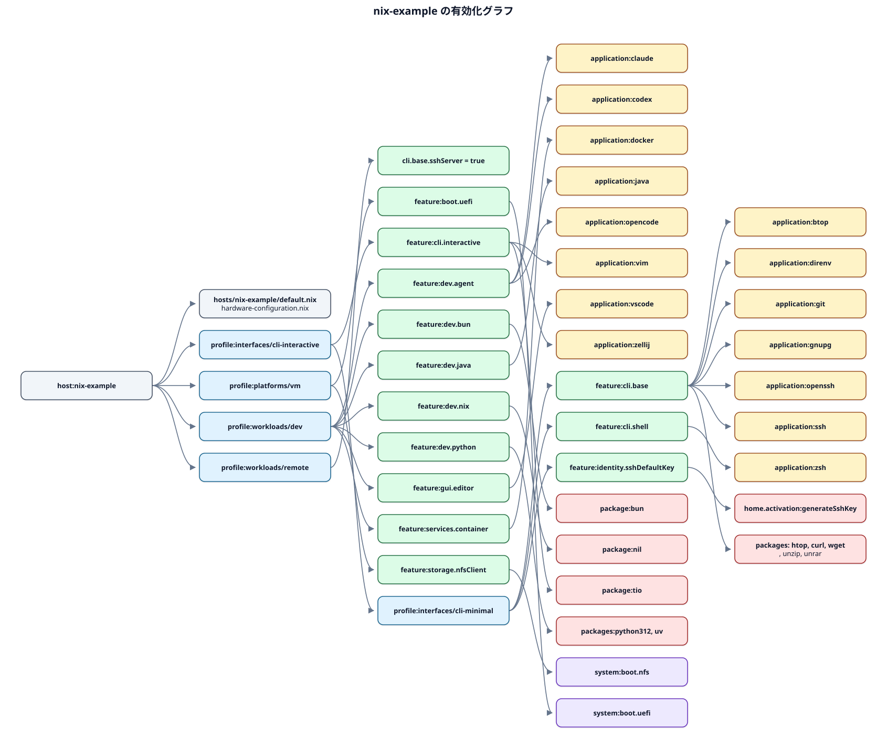
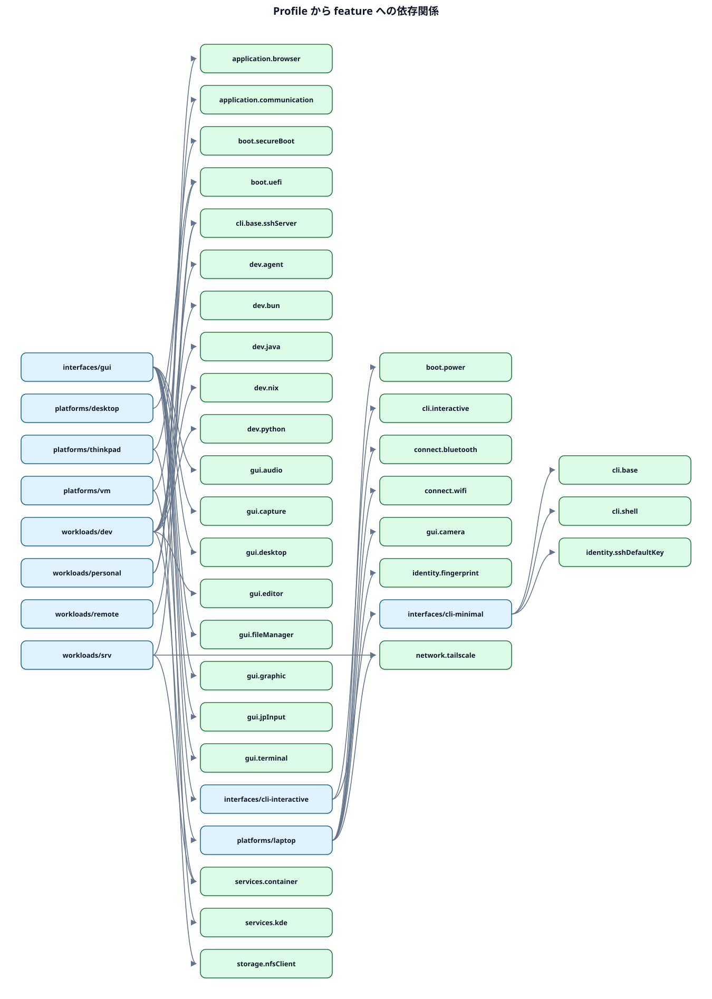
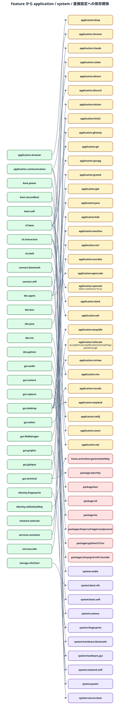

# 依存関係グラフ

このドキュメントは、`hosts` / `profiles` / `modules/features` / `modules/applications` / `modules/system` の依存関係を調査し、SVG 画像で可視化したものです。各画像の下に Mermaid ソースへのリンクも置いています。

## レイヤー全体像

`flake.nix` は flake-parts の import として `./hosts` を読み込みます。`hosts/default.nix` の `mkSystem` は、共通モジュール `../modules`、ホスト固有モジュール、profile 群、`extraModules` を NixOS module list に積みます。`../modules` は applications / drivers / features / integrations / system を常時 import し、実際の有効化は `profiles` が `my.features.*` を立て、`features` が `my.applications.*` / `my.system.*` へ委譲する流れです。

[Mermaid source](./diagrams/layer-overview.mmd)

## `nix-example` の有効化グラフ

`nix-example` は `interfaces/cli-interactive`、`platforms/vm`、`workloads/dev`、`workloads/remote` を読み込みます。`interfaces/cli-interactive` は `interfaces/cli-minimal` を import するため、CLI のベース機能と対話ツールが両方有効になります。`workloads/remote` は `my.features.cli.base.sshServer = true` だけを設定しますが、`cli-minimal` が `my.features.cli.base.enable = true` を設定しているため、`openssh` application の有効化に反映されます。

[Mermaid source](./diagrams/nix-example.mmd)

## Profile から feature への依存関係

[Mermaid source](./diagrams/profiles-to-features.mmd)

## Feature から application / system / 直接設定への依存関係

[Mermaid source](./diagrams/features-to-targets.mmd)

## 調査メモ

- `modules/applications/default.nix` と `modules/system/default.nix` は、それぞれ application module / system module を常時 import します。enable の最終値によって各モジュールの `config` が有効化されます。
- `modules/features/*` は「束ねる層」です。多くは `my.applications.*.enable` または `my.system.*.enable` を設定しますが、`environment.systemPackages` や `home-manager.sharedModules` を直接設定する feature もあります。
- `profiles/*` は feature の有効化だけを持つ薄い層です。ただし `workloads/remote` と `workloads/srv` は `cli.base.sshServer` オプションを設定し、`cli.base.enable` が別 profile で有効な場合に `openssh` application へつながります。
